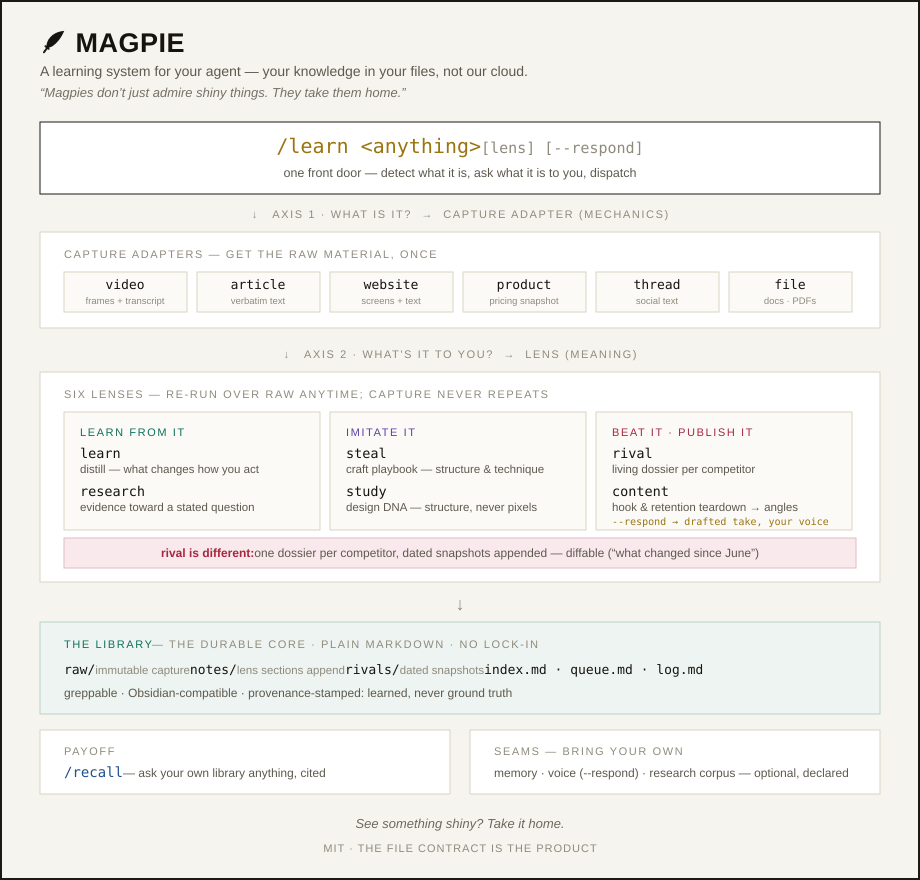

# Magpie 🪶

> *Magpies don't just admire shiny things. They take them home.*



Your AI reads everything and remembers nothing. Claude can watch a video now, read a competitor's whole site, tear through a 40-page article. Then the session ends and all of it is gone.

Magpie fixes that. Everything you feed it lands in a plain-markdown library you own, processed through a lens that matches *why* you're consuming it. No accounts, no cloud. Your knowledge in your files.

**v0.1 is out.** Built in public in one week — every box below is a real commit you can read.

## Install

Pick one:

```bash
# Claude Code plugin marketplace
/plugin marketplace add DanRWilloughby/magpie
/plugin install magpie@magpie

# skills.sh
npx skills add DanRWilloughby/magpie

# or clone it
git clone https://github.com/DanRWilloughby/magpie && cd magpie && ./install.sh
```

Then restart Claude Code and say `/magpie doctor` (checks your setup) and `/magpie start` (one question, builds your profile). Feed it a URL and you're going.

Your library lands at `~/Documents/Magpie` (override with `MAGPIE_LIBRARY`). Reinstalling replaces the skill and never touches your library.

## Why this exists

Three failure modes, and I kept hitting all of them.

**Watch-then-discard.** The agent watches the video, answers your question brilliantly, and the workdir gets deleted. Next week you ask about the same video and it starts from zero. The capability was never the problem. Keeping is the problem.

**The bookmark graveyard.** You saved 400 bookmarks because saving feels like knowing. A bookmark is a URL and a pang of intention. Nothing was extracted, so nothing compounds.

**47,000 loose skills.** The ecosystem's answer to everything is another skill to install. Curation beats volume. A small set that works as one system outperforms a pile that doesn't know itself. Magpie is one front door.

## How it works

Two axes, one command.

**Axis 1 — what the thing is** (video, article, website, product, thread, file). Magpie picks the capture adapter. Mechanics, solved for you.

**Axis 2 — what the thing is *to you*.** That's the lens, and it changes everything about the output:

| Lens | You're saying | You get |
|---|---|---|
| **Learn** | "distill this" | Takeaways that change how you'd act |
| **Research** | "evidence toward my question" | Cited findings, a verdict |
| **Steal** | "I admire this craft" | The replicable playbook |
| **Rival** | "this is a competitor" | A living dossier that diffs itself over time |
| **Content** | "teardown, then help me post" | Hook analysis, angles, an optional drafted reply in your voice |

The same URL can be steal or rival. The relationship decides, and only you know the relationship.

Rival is the one I built Magpie for. Every competitor gets one living dossier — positioning in their words, features against yours, pricing, what to counter and what to adopt. Re-capture next quarter and it tells you what changed on their pricing page. Nobody's agent does that today.

## What you end up with

A folder of markdown. That's the whole trick: transcripts, frame manifests, dossiers, digests, all plain files, all grep-able, all yours. Works offline. Survives every tool change and every pricing change, because it's just files.

## Landing this week

- [x] **The shape** — this README, the architecture, and a visual tour ([HOW-IT-WORKS.html](HOW-IT-WORKS.html), download and open in a browser)
- [x] **The library** — the file contract ([LIBRARY.md](LIBRARY.md)) + a pre-populated [example library](examples/) you can poke through
- [x] **The capture engine** — caption-first video capture in seconds, chapter-aware frames, cost receipts ([read it](skills/magpie/scripts/capture/))
- [x] **The lens system** — same capture, different output: learn, research, steal, rival, content ([read it](skills/magpie/SKILL.md))
- [x] **Rival dossiers** + the diff demo — a real teardown, live capture vs a nine-month-old baseline ([read it](examples/rivals/canva.md))
- [x] **Maintenance verbs** — doctor, forget, digest + the voice seam ([read them](skills/magpie/SKILL.md))
- [x] **v0.1** — install via plugin marketplace and skills.sh (see [Install](#install))

## What Magpie will never do

No accounts. No cloud sync. No server. No team features. No semantic search until plain grep actually fails you (it hasn't failed me yet). Local-first is the point.

## License

MIT. Take it, fork it, make it yours.

> *See something shiny? Take it home.*
